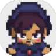

# Leak To The Past — 2D Pygame Game

<p align="center">
  
</p>

2D action-game prototype built with **Python** and **Pygame**, featuring directional character animation, multiple enemy behaviours, custom lighting/fog, projectiles, particles, drops, audio and score-based gameplay.

The project focuses on implementing gameplay systems directly with Pygame rather than relying on a full game engine.

---

## Overview

Leak To The Past is a top-down 2D action prototype where the player moves through a dark environment, fights several types of enemies and survives while managing ammunition and health.

The project includes systems for:

- 8-direction player animation
- multiple enemy archetypes
- projectile combat
- enemy projectiles
- health and ammunition
- item drops
- particles and temporary environmental effects
- custom camera rendering
- fog and local lighting
- scoring
- sound effects and music
- menu / gameplay / game-over states

---

## Gameplay Loop

```text
Move through the world
        ↓
Enemies spawn around the player
        ↓
Avoid attacks / position yourself
        ↓
Shoot enemies
        ↓
Score points + possible item drops
        ↓
Enemy behaviour becomes part of the challenge
        ↓
Survive as long as possible
```

The player starts with limited health and a finite ammunition capacity.

Enemies have different properties and behaviours, forcing the player to react differently depending on the type encountered.

---

## Controls

### Movement

The player can move in eight directions using:

```text
Z / W / ↑    Up
S / ↓        Down
Q / A / ←    Left
D / →        Right
```

Diagonal movement is normalized so moving diagonally does not make the player faster.

### Shooting

```text
Left mouse button
```

The player shoots toward the mouse position.

Shooting is only available while the player is stationary, creating a simple trade-off between movement and attacking.

### Volume

```text
+    Increase volume
-    Decrease volume
```

---

## Enemy System

The game defines several enemy archetypes with different speed, health and behaviour.

| Type | Main characteristic |
|---|---|
| Normal | Base enemy |
| Green | Faster movement |
| Yellow | More health and special death behaviour |
| Blue | Ranged attacks |
| Red | High health |
| Purple | Very fast movement with special movement behaviour |

Enemy parameters are configured centrally:

```python
TYPES = {
    'normal': {'speed': 150, 'health': 1},
    'green': {'speed': 250, 'health': 1},
    'yellow': {'speed': 200, 'health': 2},
    'blue': {'speed': 180, 'health': 2},
    'red': {'speed': 100, 'health': 10},
    'purple': {'speed': 350, 'health': 2}
}
```

Some enemy types also introduce additional gameplay rules.

Examples include:

- blue enemies can fire projectiles
- yellow enemies can generate additional enemies when defeated
- green/yellow enemies can leave temporary puddles
- red enemies can reward health
- purple enemies use faster/special movement behaviour

---

## Combat System

Player projectiles are represented as independent Pygame sprites.

Each projectile stores:

- position
- direction
- speed
- lifetime
- projectile type

The collision system uses Pygame sprite groups to detect hits between bullets and enemies.

```text
Player shoots
     ↓
Projectile created
     ↓
Projectile / enemy collision
     ↓
Enemy health reduced
     ↓
Death effects / score / possible drops
```

Special projectiles can also trigger different damage behaviour.

---

## Camera & Rendering

The project includes a custom `CameraGroup` built on top of `pygame.sprite.Group`.

The camera follows the player by calculating an offset from the player's world position.

Only the relevant tiled floor region around the viewport is drawn:

```text
Player world position
        ↓
Camera offset
        ↓
Visible rows / columns calculated
        ↓
Only visible floor tiles rendered
        ↓
Sprites drawn relative to camera
```

Sprites are sorted by their vertical position before drawing, producing a basic depth effect.

---

## Lighting & Fog

A custom fog surface is rendered on top of the game world.

A radial light mask is generated once and then used to subtract alpha around the player:

```text
Dark fog surface
       +
Radial light mask
       ↓
Alpha subtraction
       ↓
Visible area around player
```

The implementation relies on:

- `pygame.Surface`
- per-pixel alpha
- `BLEND_RGBA_SUB`
- a pre-generated radial mask

This creates a flashlight-like visibility area without using shaders or an external engine.

---

## Animation System

The player uses a spritesheet containing:

- 8 directions
- 1 static frame per direction
- 6 animation frames per direction

Directions include:

```text
north
north-east
east
south-east
south
south-west
west
north-west
```

The current animation direction is derived from the player's movement vector.

Enemy animations use a similar approach and cache processed sprite assets by enemy type to avoid repeatedly loading and transforming the same images.

---

## Asset Caching

Enemy sprite variants are stored in a class-level cache:

```python
_assets_cache = {}
```

When an enemy type is first created, its images are:

1. extracted from the spritesheet
2. scaled
3. colour-modified when required
4. stored in the cache

Subsequent enemies of the same type reuse those surfaces.

This avoids repeatedly performing the same image-loading and transformation work for every spawned enemy.

---

## Particles & Environmental Effects

The game includes lightweight visual effects implemented as sprites.

### Particles

Particles are generated when enemies are defeated.

Each particle has:

- random direction
- random speed
- limited lifetime

### Puddles

Some enemy types leave temporary puddles after death.

Puddles:

- have collision areas
- remain for a limited duration
- are rendered below other sprites

### Items

Enemies can drop items.

Dropped items:

- float vertically using a sine-wave animation
- have a limited lifetime
- blink shortly before disappearing

---

## Audio System

The game uses `pygame.mixer` for sound and music.

It contains multiple variations for several sound effects, including:

- shooting
- empty weapon feedback
- enemy/projectile sounds
- reload / recharge effects
- spawn effects
- environmental effects

Several mixer channels are reserved for specific sound categories.

A music playlist is shuffled when the game starts.

---

## Game States

The application manages several main states:

```text
menu
game
game_over
```

Starting a new game recreates gameplay sprite groups and resets:

- player
- score
- health
- ammunition / item state
- gameplay timers

---

## Project Structure

```text
leak-to-the-past-game/
├── assets/
│   ├── audio/
│   ├── font/
│   └── graphics/
│       ├── HUD/
│       └── spritesheet/
│
├── main.py
├── sprites.py
├── settings.py
├── favicon.png
└── README.md
```

### `main.py`

Contains the main game loop and high-level systems:

- game states
- spawning
- camera
- combat interactions
- collision handling
- score
- audio
- rendering orchestration

### `sprites.py`

Contains gameplay entities such as:

- `Player`
- `Enemy`
- `Bullet`
- `EnemyBullet`
- `Particle`
- `Puddle`
- `Item`

### `settings.py`

Centralizes configuration such as:

- resolution
- FPS
- tile size
- ammunition
- drop probability
- volume settings

---

## Tech Stack

**Language**

- Python

**Library**

- Pygame

**Concepts**

- real-time game loop
- sprite-based architecture
- vector movement
- collision detection
- camera systems
- animation
- asset caching
- alpha blending
- particle effects
- audio management
- finite gameplay states

---

## Installation

### Requirements

- Python 3
- Pygame

Clone the repository:

```bash
git clone https://github.com/Lasryy/leak-to-the-past-game.git
cd leak-to-the-past-game
```

Install Pygame:

```bash
pip install pygame
```

Run the game:

```bash
python main.py
```

---

## Technical Highlights

### Normalized movement

Player movement uses vectors and normalizes diagonal input to avoid increased diagonal speed.

### Sprite asset reuse

Enemy sprites are cached by type instead of being reloaded for every instance.

### Limited-lifetime entities

Bullets, particles, puddles and item drops automatically remove themselves after their configured lifetime.

### Camera-relative rendering

World entities keep world coordinates while rendering is performed relative to the camera offset.

### Lightweight local lighting

The visibility effect is implemented entirely with Pygame surfaces and alpha blending.

---

## Project Status

This repository is a **gameplay prototype / personal game-development project**.

Its purpose is to experiment with low-level gameplay systems in Python and Pygame rather than to provide a production-ready game.

---

## What This Project Demonstrates

This project showcases experience with:

- Python application structure
- object-oriented gameplay code
- real-time input and update loops
- 2D vector mathematics
- sprite and collision systems
- custom camera rendering
- performance-aware asset reuse
- procedural visual effects
- audio integration
- gameplay-state management

---

<details>
<summary><strong>🇫🇷 Version française</strong></summary>

<br>

# Leak To The Past — Jeu 2D avec Pygame

<p align="center">
  
</p>

Prototype de jeu d'action 2D développé en **Python** avec **Pygame**, comprenant animations directionnelles, plusieurs comportements d'ennemis, éclairage/fog personnalisé, projectiles, particules, drops, audio et système de score.

Le projet consiste principalement à implémenter directement les systèmes de gameplay avec Pygame, sans s'appuyer sur un moteur de jeu complet.

---

## Présentation

Leak To The Past est un prototype d'action 2D en vue du dessus dans lequel le joueur évolue dans un environnement sombre, affronte plusieurs types d'ennemis et doit survivre en gérant ses munitions et sa vie.

Le projet comprend notamment :

- animation du joueur dans 8 directions
- plusieurs archétypes d'ennemis
- combat par projectiles
- projectiles ennemis
- système de vie et de munitions
- drops d'objets
- particules et effets environnementaux temporaires
- caméra personnalisée
- brouillard et éclairage local
- score
- effets sonores et musique
- états menu / jeu / game over

---

## Boucle de gameplay

```text
Se déplacer dans le monde
        ↓
Apparition d'ennemis
        ↓
Éviter les attaques / se positionner
        ↓
Tirer sur les ennemis
        ↓
Gagner des points + éventuels drops
        ↓
S'adapter aux différents comportements
        ↓
Survivre le plus longtemps possible
```

---

## Contrôles

### Déplacement

```text
Z / W / ↑    Haut
S / ↓        Bas
Q / A / ←    Gauche
D / →        Droite
```

Le déplacement diagonal est normalisé afin d'éviter une vitesse supérieure en diagonale.

### Tir

```text
Clic gauche
```

Le joueur tire vers la position de la souris.

Le tir n'est possible que lorsque le joueur est immobile, créant un compromis simple entre déplacement et attaque.

### Volume

```text
+    Augmenter
-    Diminuer
```

---

## Système d'ennemis

Plusieurs types d'ennemis possèdent des caractéristiques différentes.

| Type | Caractéristique principale |
|---|---|
| Normal | Ennemi de base |
| Vert | Plus rapide |
| Jaune | Plus résistant et comportement spécial à la mort |
| Bleu | Attaques à distance |
| Rouge | Beaucoup de vie |
| Violet | Déplacement très rapide / comportement spécial |

Certains types possèdent aussi des règles particulières :

- les ennemis bleus peuvent tirer
- les jaunes peuvent générer d'autres ennemis lorsqu'ils meurent
- les verts et jaunes peuvent laisser des flaques temporaires
- les rouges peuvent rendre de la vie
- les violets utilisent un déplacement plus rapide et spécifique

---

## Combat

Les projectiles sont représentés par des sprites Pygame indépendants.

Chaque projectile possède notamment :

- une position
- une direction
- une vitesse
- une durée de vie
- un type

Les collisions entre projectiles et ennemis sont gérées avec les groupes de sprites Pygame.

```text
Tir du joueur
     ↓
Création du projectile
     ↓
Collision projectile / ennemi
     ↓
Réduction de la vie
     ↓
Mort / score / effets / drop éventuel
```

---

## Caméra et rendu

Le projet comprend une classe `CameraGroup` personnalisée basée sur `pygame.sprite.Group`.

La caméra suit la position du joueur et applique un offset aux éléments du monde lors du rendu.

La grille de sol est calculée uniquement pour la zone visible autour de l'écran.

Les sprites sont ensuite triés selon leur position verticale avant l'affichage afin de produire un effet simple de profondeur.

---

## Éclairage et brouillard

Un calque sombre est dessiné au-dessus du monde.

Un masque radial est généré puis soustrait du canal alpha autour du joueur.

```text
Calque sombre
      +
Masque lumineux radial
      ↓
Soustraction alpha
      ↓
Zone visible autour du joueur
```

Le système utilise notamment :

- `pygame.Surface`
- alpha par pixel
- `BLEND_RGBA_SUB`
- masque radial précalculé

L'effet est donc obtenu directement avec Pygame, sans shader.

---

## Animations

Le personnage utilise une spritesheet contenant :

- 8 directions
- 1 frame statique par direction
- 6 frames animées par direction

Les directions prises en charge sont :

```text
north
north-east
east
south-east
south
south-west
west
north-west
```

La direction d'animation est calculée à partir du vecteur de déplacement.

---

## Cache des assets

Les variantes graphiques des ennemis sont conservées dans un cache partagé :

```python
_assets_cache = {}
```

Lors de la première création d'un type d'ennemi, ses images sont :

1. extraites de la spritesheet
2. redimensionnées
3. recolorées si nécessaire
4. stockées en cache

Les prochains ennemis du même type réutilisent les surfaces déjà calculées.

---

## Particules et effets

### Particules

Des particules sont créées à la mort de certains ennemis.

Elles possèdent :

- direction aléatoire
- vitesse aléatoire
- durée de vie limitée

### Flaques

Certains ennemis laissent des flaques temporaires.

Elles :

- possèdent une zone de collision
- disparaissent après quelques secondes
- sont rendues sous les autres sprites

### Objets

Les objets lâchés par les ennemis :

- flottent verticalement avec une animation sinusoïdale
- ont une durée de vie limitée
- clignotent avant de disparaître

---

## Audio

Le projet utilise `pygame.mixer`.

Il contient plusieurs variantes de sons pour :

- tirs
- arme vide
- projectiles / ennemis
- recharge
- apparition
- effets environnementaux

Plusieurs canaux audio sont réservés à certaines catégories de sons.

Une playlist est également mélangée au démarrage.

---

## Structure

```text
leak-to-the-past-game/
├── assets/
│   ├── audio/
│   ├── font/
│   └── graphics/
│       ├── HUD/
│       └── spritesheet/
│
├── main.py
├── sprites.py
├── settings.py
├── favicon.png
└── README.md
```

---

## Stack technique

**Langage**

- Python

**Bibliothèque**

- Pygame

**Concepts**

- boucle temps réel
- architecture à base de sprites
- mouvements vectoriels
- collisions
- caméra
- animation
- cache d'assets
- alpha blending
- particules
- gestion audio
- états de jeu

---

## Installation

### Prérequis

- Python 3
- Pygame

Cloner :

```bash
git clone https://github.com/Lasryy/leak-to-the-past-game.git
cd leak-to-the-past-game
```

Installer Pygame :

```bash
pip install pygame
```

Lancer :

```bash
python main.py
```

---

## Points techniques

### Déplacement normalisé

Les déplacements utilisent des vecteurs normalisés afin de conserver une vitesse identique dans toutes les directions.

### Réutilisation des sprites

Les assets des ennemis sont mis en cache par type plutôt que d'être rechargés à chaque création.

### Entités temporaires

Projectiles, particules, flaques et objets gèrent automatiquement leur propre durée de vie.

### Coordonnées monde / caméra

Les entités conservent leur position dans le monde, tandis que le rendu utilise un offset de caméra.

### Éclairage local léger

La visibilité est produite uniquement avec des surfaces Pygame et du mélange alpha.

---

## État du projet

Ce dépôt correspond à un **prototype de gameplay / projet personnel de développement de jeu**.

Son objectif est principalement d'expérimenter des systèmes de gameplay bas niveau en Python et Pygame, plutôt que de constituer un jeu destiné à la production.

---

## Ce que ce projet démontre

Le projet met notamment en avant :

- structuration d'une application Python
- programmation orientée objet
- boucle de jeu temps réel
- mathématiques vectorielles 2D
- sprites et collisions
- caméra personnalisée
- réutilisation d'assets pour limiter les traitements
- effets visuels procéduraux
- intégration audio
- gestion des états de gameplay

</details>
